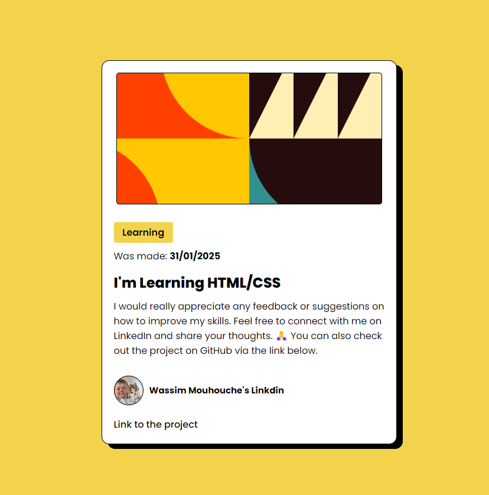
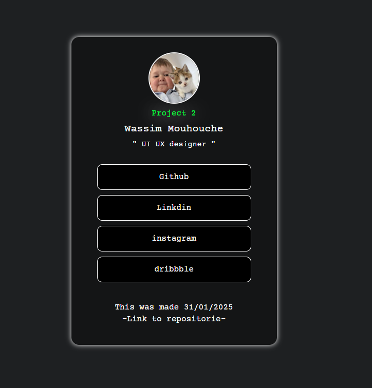

# HTML-CSS
A basic project to practice HTML and CSS. This repository contains a static webpage showcasing a clean and responsive design. Built as part of my journey into web development. Here, I am sharing my projects in HTML and CSS, showing my progress.

## Project 01

## Project 02

## Project 03

## Project 04

## Project 05

## Project 06

## Project 07

